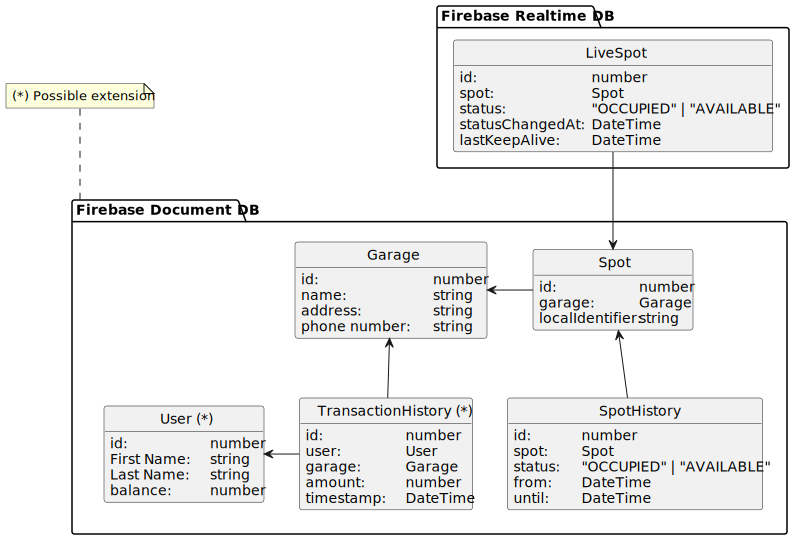

# Find my Spot - PIOT

Authors: Joshua Gawenda & Jonathan Brocksieper

## Introduction

The intention of this project is to create a smart parking solution with some analytical possibilities. To achieve this, each parking spot is equipped with an ultrasonic sensors and two LEDs (One red, one green). If the parking spot is free, the green LED will light up. Whenever the ultrasonic sensor detects a car, the red LED will light up instead. The live number of available parking spots will be displayed on a website and stored in a database.

## Parts list

| Amount    | Name             | Description       |
|-----------|------------------|-------------------|
| 1         | Lopy4            |                   |
| 1         | Raspberry Pi     |                   |
| 3         | HCSR04           | Ultrasonic sensor |
| 3         | LED red          |                   |
| 3         | LED green        |                   |
| 6         | 150 Ohm resistor |                   |
| 1         | Breadboard       |                   |
| 1 package | Jumper wires     |                   |

## Architecture

The architecture of this project mainly consists of a Lopy4 (Thing) and a Raspberry Pi (Server). The Lopy4 is responsible for getting the readings of the ultrasonic sensors and turn on the LEDs corresponding to that. It will also send updates of the parking availability and other statistical data to the API hosted on the Raspberry Pi via MQTT, where the Raspberry Pi also works as the MQTT Broker.

This data will be spread across two databases which are hosted in a Google Firebase project. The realtime database stores the availability of the parking spots while the document database stores historic data such as the duration of an occupied parking spot.

A web interface will be hosted on the Raspberry Pi to allow for easy reading access for the live parking spot availability, as well as a detailed look at the historic data.

### Architecture Diagram

### Initial Domain Model

## Possible extensions

During planning of the initial concept of this project, we came through multiple extensions we might want to add during the course of this project.

1. The web interface will be extended to also include a booking function to reserve parking spots which will be handeled as a taken parking spot. These will be removed from the live availability counter and also displayed with the red LED over an empty parking spot.
2. Implement an RFID scanner and gate into the system. The RFID scanner will be able to read a user account and balance and open the gate if enough balance is available. The gate will remain closed if there is not enough balance on the account or if there are no more available spots.

### Parts

| Amount | Name                     | Description              |
|--------|--------------------------|--------------------------|
| 1      | RFID MIFARE RC522        | RFID reader/writer       |
| 1      | SG90                     | Servo Motor              |
| 1      | 5V external power source | To power the servo motor |
