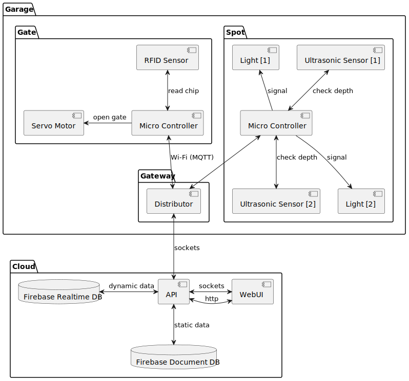

# Find my Spot - PIOT

Authors: Joshua Gawenda & Jonathan Brocksieper

## Introduction

The intention of this project is to create a smart parking solution with some analytical possibilities. To achieve this, each parking spot is equipped with an ultrasonic sensors and two LEDs (One red, one green). If the parking spot is free, the green LED will lit up. Whenever the ultrasonic sensor detects a car, the red LED will lit up instead. All of this will be monitored and stored across 2 databases to perform analytics.

## Parts list

| Amount      | Name             | Description       |
| ----------- | ---------------- | ----------------- |
| 1           | Lopy4            |                   |
| 1           | Raspberry Pi     |                   |
| 3           | HCSR04           | Ultrasonic sensor |
| 3           | LED red          |                   |
| 3           | LED green        |                   |
| 6           | 150 Ohm resistor |                   |
| 1           | Breadboard       |                   |
|             | Jumper wires     |                   |

## Architecture

The architecture of this project mainly consists of a Lopy4 (Thing) and a Raspberry Pi (Server). The Lopy4 is responsible for getting the readings of the ultrasonic sensors and turn on the LEDs corresponding to that. It will also send updates of the parking availability and other statistical data to the Raspberry Pi via MQTT.

This data will be spread across two databases which are hosted in a Google Firebase project. The realtime database stores the availability of the parking spots while the document database stores historic data such as the duration of an occupied parking spot for example.

A web user interface allows us to look at this data in a more structured fashion. This interface will also include a booking function to reserve parking spots which will be indicated by a red lit up LED on the booked parking spot.

## Possible extensions

During planning of the initial concept of this project, we came through multiple extensions we might want to add during the course of this project.

The first extension we thought of is to have an RFID scanner and a gate at the entrance of the parking lot. The gate will then open if the RFID scanner recognizes the card. If that is not the case, the gate will remain closed.

### Parts

| Amount      | Name                    | Description             |
| ----------- | ----------------------- | ----------------------- |
| 1           | RFID MIFARE RC522       | RFID reader/writer      |
| 1           | SG90                    | Servo Motor             |
| 1           | 5V external power source| To power the servo motor|
